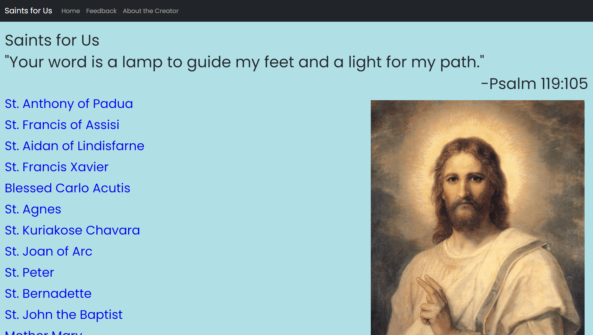
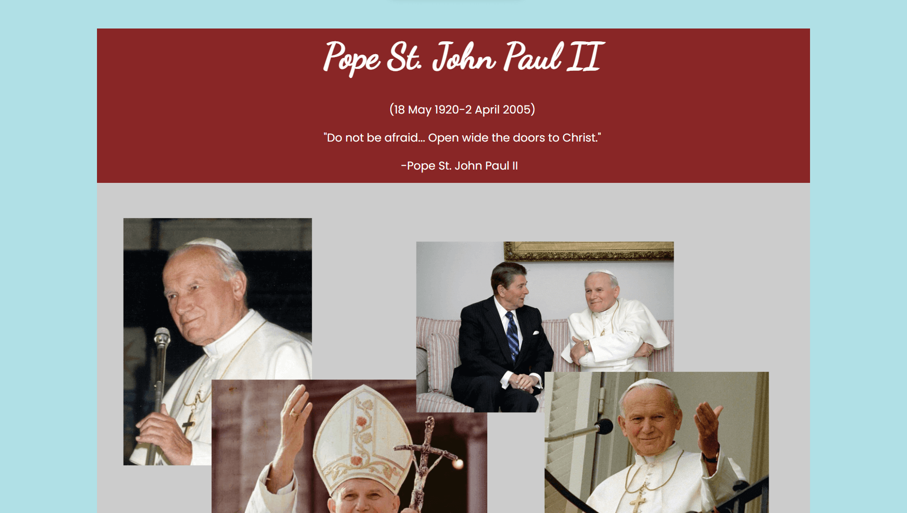

# Saints for Us

This is a website about a few saints. This is a personal project that I began because there are not  
many websites on this topic. This project uses PHP for the backend and I have used PHPMailer  
to send the mail in the feedback form. I have used SCSS and TypeScript for the frontend.

## Content and Styling

All the styles are custom.
I will probably dockerize this application later on.  
To visit the site, head to [https://saintsforus.com](https://saintsforus.com)

## Running Locally

1. Install the dependencies with PNPM and Composer:
    ```bash
    pnpm install
    composer install
    ```
1. Compile the TypeScript code:
    ```bash
    pnpm prod
    ```
1. Compile the Sass code:
    ```bash
    pnpm sass:prod
    ```
1. Create a .env file in the website directory with the following keys:
    - SENDER_EMAIL: An email id to send a mail in the contact form page.
    - SENDER_EMAIL_PASSWORD: The password for the email sender.
    - SMTP_HOST: The SMTP host.
    - SMTP_PORT: The port to connect to.
    - EMAIL_RECEIVER: A receiver email to get the mail sent by the email sender.
1. Start your PHP Server.
1. Open your browser and head to `http://localhost/saintsforus-php`
   (This repository should be saved in the htdocs folder)

## Contact

If you have any feedback, comments or criticism, please mail your queries to info.saintsforus@gmail.com

## Inspiration

Some inspiration to make this website came from [miracolieucaristici.org](http://www.miracolieucaristici.org/)

## Pictures

<p align="center">
    
    <br>
    <br>
    
</p>

## Testing

This app uses Playwright for testing. Run tests with `pnpm test`
